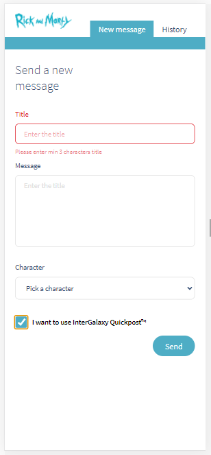
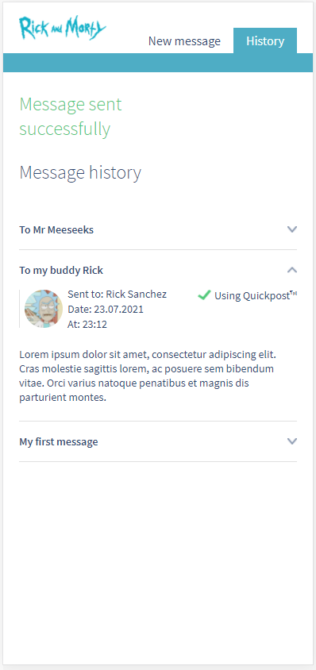
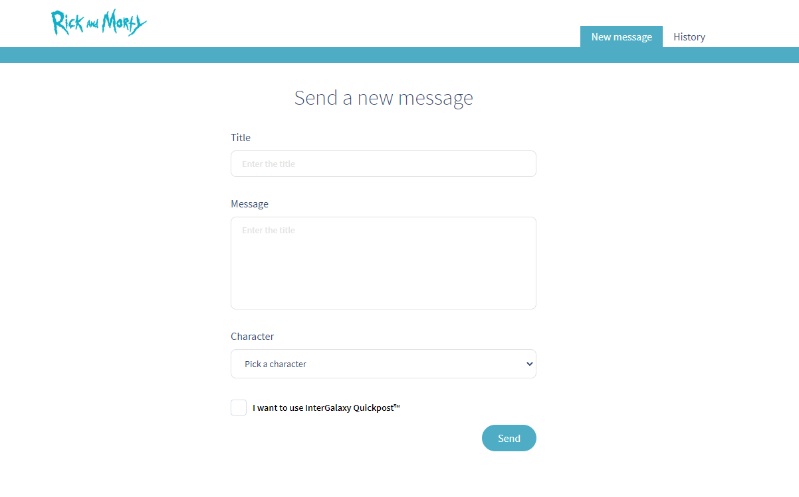
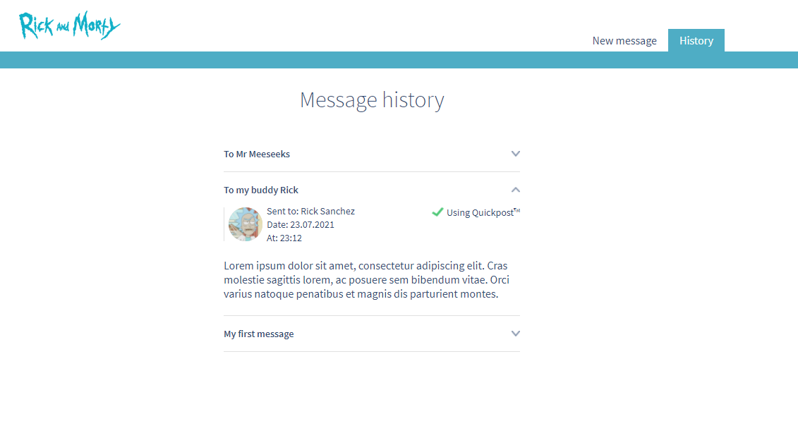

# rick-and-morty-in-vue-js

**Demo on Netlify:** [https://adoring-fermi-c8358c.netlify.app/](https://adoring-fermi-c8358c.netlify.app/)

## Overview

**RickyAndMorphyApp** is a frontend application created in Vue framework. User would send the message to a virtual movie
character and read previous sent messages. Date are storage in your Local Storage between sessions. Characters are taken
from API. The application validates the data. Project is created pixel-perfect implementation for both mobile and
desktop layouts in Figma. App is full responsive. CSS Frameworks are not used. What's your message?

**RaM API URL:** [https://rickandmortyapi.com/documentation/#rest](https://rickandmortyapi.com/documentation/#rest)

###### The following technologies/library/methodology were used:

- Vue.js 3 framework
- Vue 3 Composition API
- Vue router
- Axios
- Atomic design architecture
- Prettier
- Husky
- UUID generator
- SCSS
- BEM methodology
- Mobile First & and full responsive
- Clean Code
- the newest features of ECMAScript
- Figma project
- Pixel-perfect implementation
- Git & GitHub
- IntelliJ

###### Screens:






---

## Running the project

Running this project locally

###### From the repo:

1. Clone this project locally.
2. Run `npm install` in your bash/command line.
3. Run `npm run serve` in your bash/command line.
4. Go to `http://localhost:8080/` in your browser (or other from your bash/command line info).

---

### Others:

###### Compiles and hot-reloads for development

```
npm run serve
```

###### Compiles and minifies for production

```
npm run build
```

###### Lints and fixes files

```
npm run lint
```

### Customize configuration

See [Configuration Reference](https://cli.vuejs.org/config/).

---

### Authors

**Piotr Rynio**  
Contact:
pwrynio@gmail.com  
github.com/PiotrRynio/
